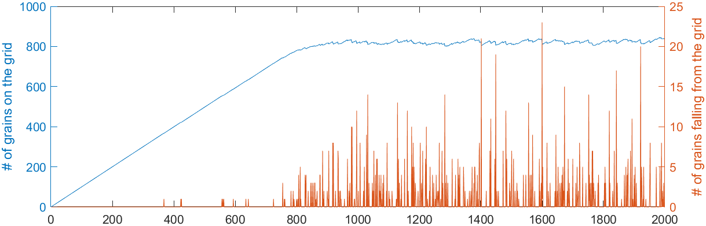

# Sandpile

Reduced complexity, cellular automaton model (CA) of a sandpile on a 2-dimensional grid. Each time step a sandgrain is added to a random location on the grid. When the critical number of grains in a cell exceeds 3 all grains in the cell are turned to the 4 neighbors (v. Neumann Neighborhood). This avalanche may prograde and trigger even more avalanches. After a while the sandpile comes to a state of self-organized criticality.
